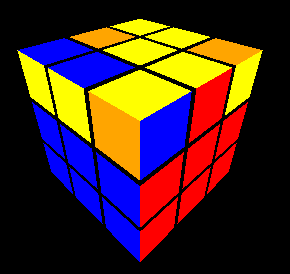
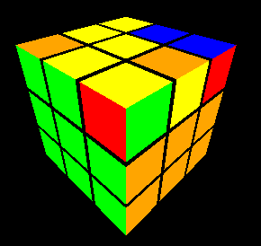

# How to Use the Rubik's Cube Application

Welcome to the Rubik's Cube application! This guide will help you understand how to use the application to solve a Rubik's Cube.

## Getting Started

1. **Open the Application**: Navigate to the application URL in your web browser.
2. **Title and Link**: At the top of the page, you'll see the title "Rubik's Cube" and a link to a detailed guide on how to solve the Rubik's Cube.

## Interface Overview

- **Undo/Redo Buttons**: Located below the title, these buttons allow you to undo or redo your last moves.
- **Mix Cube Button**: This button shuffles the cube randomly.
- **Execute Sequence Button**: Enter a sequence of moves in the text field and click this button to execute them.
- **Set Solved Button**: Resets the cube to the solved state.
- **Hint Text**: Displays hints to guide you through solving the cube based on its current state.
- **Cube Canvas**: The 3D representation of the Rubik's Cube where you can see your moves in action.

## Controls

### Keyboard Shortcuts

- **Arrow Keys**: Rotate the entire cube.
- **Face Rotations**: Use the following keys to rotate specific faces:
  - `U` (Up face)
  - `R` (Right face)
  - `L` (Left face)
  - `F` (Front face)
  - `B` (Back face)
  - `D` (Down face)
- **Modifiers**:
  - `'` or `#`: Rotate counterclockwise.
  - `w`: Rotate wide.

### Buttons

- **Mix Cube**: Click to shuffle the cube randomly.
- **Execute Sequence**: Enter a sequence of moves in the text field and click to execute them.
- **Set Solved**: Click to reset the cube to the solved state.
- **Undo/Redo**: Click to undo or redo your last moves.

## Solving the Cube

The application provides hints to guide you through solving the cube:

1. **Make a White Cross**: The first hint will prompt you to make a white cross on the top face.
2. **Complete the First Layer**: Once the white cross is complete, the next hint will guide you to complete the first layer with the white face.
3. **Complete the First Two Layers**: After completing the first layer, the hint will guide you to complete the first two layers.
4. **Solve the Cube**: Finally, the hint will guide you to solve the entire cube.

## Example Move Sequences

- **Line to Fish**: `F R U R' U' F'`
- **Corner to Fish**: `Fw R U R' U' Fw'`
- **Fish to Yellow**: `R U R' U R U2 R'`
- **Rotate 3 Edges**: `R' U R' U' R' U' R' U R U R2`
- **Rotate 3 Corners**: `R U' R D2 R' U R D2 R2`

## Solving the Cube

### Make a white cross
You only need simple moves for this.

#### Intended result:

 

### Complete the first layer
#### Step 1 - Insert the corners
##### Example - Rotate Corner Right
| Before | After |
|--------|-------|
|  |  |

##### Example - Rotate Corner Left
| Before | After |
|--------|-------|
|  |  |

##### Example - Insert Corner Right
| Before | After |
|--------|-------|
|  |  |

##### Example -  Insert Corner Left
| Before | After |
|--------|-------|
|  |  |

#### Step 2 - Insert Edges with Auto Move
##### Example - Insert Edge Right
| Before | After |
|--------|-------|
|  |  |

##### Example - Insert Edge Left
| Before | After |
|--------|-------|
|  |  |

#### Intended Result:

### Solve the last layer
#### Step 1 - Line or Corner to Fish
Hint: if you dont have a line or corner (i.e. you have only a dot), just make the Line to Fish move to get a Corner.

##### Example - Line to Fish
(The line must be central and horizontal, as in the picture)
| Before | After |
|--------|-------|
|  |  |

##### Example - Corner to Fish
(The corner must be in the front-right, as in the picture)
| Before | After |
|--------|-------|
|  |  |

#### Step 2 - From Fish to Yellow Face
* There are 7 types of fish.
* With the **Fish to Yellow** move, you can get a yellow last layer out of Fish Type 1a.
* For other Fish types, you can use the **Fish to Yellow** move to get the Fish Type 1a. Experiment a little bit! You may need to repeat the move several times until you learn it.

| Type 1a | Type1b |
|--------|-------|
|  |  |

| Type 2 | Type 3 |
|--------|-------|
|  |  |

| Type 4 | Type5 |
|--------|-------|
|  |  |

| Type 6 | |
|--------|-------|
|  | |

##### Example - Fish Type 1a to Yellow last layer
| Before | After |
|--------|-------|
|  |  |

#### Step 3 - Orientate the Yellow Edges:
* a) Rotate the upper layer to have one edge in the right position
* b) Use the ** Rotate 3 edges ** move to rotate the remaining edges in clockwise direction. 
* Depending on how the edges are initially, you may need to repeat the procedure (a and b)
##### Example - Rotate 3 Edges
(The well oriented edge must be at front, as in the picture)
| Before | After |
|--------|-------|
|  |  |

#### Step 4 - Orientate the Yellow Corners:
* Put the yellow face in front
* Rotate the yellow (front) face to get one right oriented edge
* a) Rotate the cube to put the right oriented edge front-left-up (if there is no right oriented edge, skip this and next step, you will need to repeat it later)
* b) Rotate the upper layer to have one edge in the right position
* c) Use the ** Rotate 3 corners ** move to rotate the remaining corners in counterclockwise direction. 
* Depending on how the corners are initially, you may need to repeat the procedure (a, b and c)

##### Example - Rotate 3 Corners
(The well oriented corner must be at front-left-up, as in the picture)
| Before | After |
|--------|-------|
|  |  |

**Congratulations, you have finished the cube!**

## Conclusion

Enjoy solving the Rubik's Cube with this application! Happy cubing!