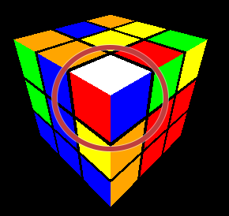
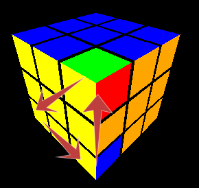

# How to Use the Rubik's Cube Application

Welcome to the Rubik's Cube application! This guide will help you understand how to use the application to solve a Rubik's Cube.

Try the app online: [Rubik's Cube Web Application](https://rubiks-cube-app-omega.vercel.app/)

## Getting Started

1. **Open the Application**: Navigate to the application URL in your web browser.
2. **Title and Link**: At the top of the page, you'll see the title "Rubik's Cube" and a link to a detailed guide on how to solve the Rubik's Cube.

## Interface Overview

- **Undo/Redo Buttons**: Located below the title, these buttons allow you to undo or redo your last moves.
- **Mix Cube Button**: This button shuffles the cube randomly.
- **Execute Sequence Button**: Enter a sequence of moves in the text field and click this button to execute them.
- **Set Solved Button**: Resets the cube to the solved state.
- **Hint Text**: Displays hints to guide you through solving the cube based on its current state.
- **Single Move Buttons**: To make moves in mobile devices without keyboard.

## Controls

### Keyboard Shortcuts

- **NumPad numbers**: Rotate the entire cube.
  - `1` (x)
  - `9` (x')
  - `6` (y)
  - `4` (y')
  - `7` (z)
  - `3` (z')
- **Face Rotations**: Use the following keys to rotate specific faces:
  - `U` (Up face)
  - `R` (Right face)
  - `L` (Left face)
  - `F` (Front face)
  - `B` (Back face)
  - `D` (Down face)
- **Modifiers** (keep hold while rotating faces):
  - `'` or `#`: Rotate counterclockwise.
  - `w`: Rotate wide.

### Buttons

- **Mix Cube**: Click to shuffle the cube randomly.
- **Execute Sequence**: Enter a sequence of moves in the text field and click to execute them.
- **Set Solved**: Click to reset the cube to the solved state.
- **Undo/Redo**: Click to undo or redo your last moves.

## Solving the Cube

The application provides hints to guide you through solving the cube:

1. **Make a White Cross**: The first hint will prompt you to make a white cross on the top face.
2. **Complete the First Layer**: Once the white cross is complete, the next hint will guide you to complete the first layer with the white face.
3. **Complete the First Two Layers**: After completing the first layer, the hint will guide you to complete the first two layers.
4. **Solve the Cube**: Finally, the hint will guide you to solve the entire cube.

### More complex moves

Here are the more complex moves you can perform using the buttons in the application:

- **Rotate Corner Left**: `L' U2 L U`
- **Rotate Corner Right**: `R U2 R' U'`
- **Insert Corner Left**: `L' U' L`
- **Insert Corner Right**: `R U R'`
- **Auto Move Left**: `U' L' U L U F U' F'`
- **Auto Move Right**: `U R U' R' U' F' U F`
- **Line to Fish**: `F R U R' U' F'`
- **Corner to Fish**: `Fw R U R' U' Fw'`
- **Fish to Yellow**: `R U R' U R U2 R'`
- **Rotate 3 Edges**: `R' U R' U' R' U' R' U R U R2`
- **Rotate 3 Corners**: `R U' R D2 R' U R D2 R2`

## Solving the Cube

### Make a White Cross
You only need simple moves for this.

#### Intended Result:
|||
|--------|-------|
| ||

### Complete the First Layer

Hint: Turn the cube with the yellow central piece to the top face.

#### Step 1 - Insert the Corners

* We want to insert the right edge pieces from the top layer to the right bottom corner.
* For this place the corresponding piece in the corresponding corner on the top layer.
* If the corner has the white face on top, we need to rotate the corner with the corresponding move (either on left or right side).
* Finally you can insert the corner from top to bottom layer.

##### Example - Rotate Corner Right
R U2 R' U'
| Before | After |
|--------|-------|
|  |  |

##### Example - Rotate Corner Left
L' U2 L U
| Before | After |
|--------|-------|
|  |  |

##### Example - Insert Corner Right
R U R'
| Before | After |
|--------|-------|
|  |  |

##### Example - Insert Corner Left
L' U' L
| Before | After |
|--------|-------|
|  |  |

#### Step 2 - Insert Edges with Auto Move
* We want to insert edges on the top layer to the right place on the second layer.
* Place the corresponding edge on the right face to be introduced
* Then do the Auto Move (either left or right) to insert the corner.
* If your edge is not in the top layer, but in the second, you need to bring it first to the top layer by inserting any other edge in its place with the Auto Move.
##### Example - Insert Edge Right
U R U' R' U' F' U F (Auto Move Right)
| Before | After |
|--------|-------|
|  |  |

##### Example - Insert Edge Left
U' L' U L U F U' F' (Auto Move Left)
| Before | After |
|--------|-------|
|  |  |

#### Intended Result:

|||
|--------|-------|
|||

### Solve the Last Layer
#### Step 1 - Line or Corner to Fish
Hint: If you don't have a line or corner (i.e., you have only a dot), just make the Line to Fish move to get a Corner.

##### Example - Line to Fish
(The line must be central and horizontal, as in the picture)

F R U R' U' F' (Line to Fish)
| Before | After |
|--------|-------|
|  |  |

##### Example - Corner to Fish
(The corner must be in the front-right, as in the picture)

Fw R U R' U' Fw' (Corner to Fish)
| Before | After |
|--------|-------|
|  |  |

#### Step 2 - From Fish to Yellow Face
* There are 7 types of fish.
* With the **Fish to Yellow** move, you can get a yellow last layer out of Fish Type 1a.
* For other Fish types, you can use the **Fish to Yellow** move to get the Fish Type 1a. Experiment a little bit! You may need to repeat the move several times until you learn it.

| Type 1a | Type 1b |
|--------|-------|
|  |  |

| Type 2 | Type 3 |
|--------|-------|
|  |  |

| Type 4 | Type 5 |
|--------|-------|
|  |  |

| Type 6 | |
|--------|-------|
|  | |

##### Example - Fish Type 1a to Yellow Last Layer
R U R' U R U2 R' (Fish To Yellow)
| Before | After |
|--------|-------|
|  |  |

#### Step 3 - Orient the Yellow Edges:
* a) Rotate the upper layer to have one edge in the right position.
* b) Use the **Rotate 3 Edges** move to rotate the remaining edges in a clockwise direction. 
* Depending on how the edges are initially, you may need to repeat the procedure (a and b).
##### Example - Rotate 3 Edges
(The well-oriented edge must be at the front, as in the picture)

R' U R' U' R' U' R' U R U R2 (Rotate 3 Edges)
| Before | After |
|--------|-------|
|  |  |

#### Step 4 - Orient the Yellow Corners:
* Put the yellow face in front.
* Rotate the yellow (front) face to get one correctly oriented edge.
* a) Rotate the cube to put the correctly oriented edge front-left-up (if there is no correctly oriented edge, skip this and the next step; you will need to repeat it later).
* b) Rotate the upper layer to have one edge in the right position.
* c) Use the **Rotate 3 Corners** move to rotate the remaining corners in a counterclockwise direction. 
* Depending on how the corners are initially, you may need to repeat the procedure (a, b, and c).

##### Example - Rotate 3 Corners
(The well-oriented corner must be at front-left-up, as in the picture)

R U' R D2 R' U R D2 R2 (Rotate 3 Corners)
| Before | After |
|--------|-------|
|  |  |

**Congratulations, you have finished the cube!**

## Conclusion

Enjoy solving the Rubik's Cube with this application! Happy cubing!