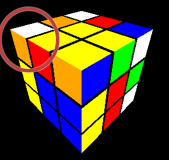
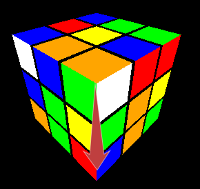
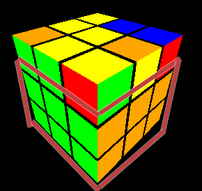
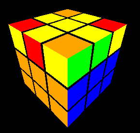
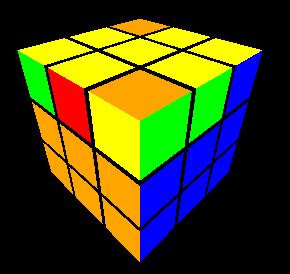
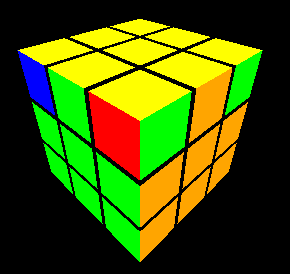

[English Version](./HowTo.md) | [German Version](./HowTo_DE.md) | [Spanish Version](./HowTo_ES.md) | [Chinese Version](./HowTo_CN.md)

# 如何使用魔方应用程序

欢迎使用魔方应用程序！本指南将帮助您了解如何使用该应用程序来解决魔方。

在线试用该应用程序：[魔方网络应用程序](https://rubiks-cube-app-omega.vercel.app/)

## 入门

1. **打开应用程序**：在您的网络浏览器中导航到应用程序的URL。
2. **标题和链接**：在页面顶部，您将看到标题“魔方”和一个链接，指向详细的魔方解决指南。

## 界面概述

- **撤销/重做按钮**：位于标题下方，这些按钮允许您撤销或重做上一次的操作。
- **混合魔方按钮**：此按钮随机打乱魔方。
- **执行序列按钮**：在文本框中输入一系列动作，然后点击此按钮执行它们。
- **设置为已解决按钮**：将魔方重置为已解决状态。
- **提示文本**：根据魔方的当前状态显示提示，指导您解决魔方。
- **单步移动按钮**：在没有键盘的移动设备上进行移动。

## 控制

### 键盘快捷键

- **数字键盘数字**：旋转整个魔方。
  - `1` (x)
  - `9` (x')
  - `6` (y)
  - `4` (y')
  - `7` (z)
  - `3` (z')
- **面旋转**：使用以下键旋转特定的面：
  - `U` (上面)
  - `R` (右面)
  - `L` (左面)
  - `F` (前面)
  - `B` (后面)
  - `D` (下面)
  - **切片移动**：旋转整个魔方。
  - `M` (切片 x)
  - `E` (切片 y)
  - `S` (切片 z)
- **修饰键**（在旋转面时按住）：
  - `'` 或 `#`：逆时针旋转。
  - `w`：宽旋转。

### 按钮

- **混合魔方**：点击随机打乱魔方。
- **执行序列**：在文本框中输入一系列动作并点击执行它们。
- **设置为已解决**：点击将魔方重置为已解决状态。
- **撤销/重做**：点击撤销或重做上一次的操作。

## 解决魔方

该应用程序提供提示，指导您解决魔方：

1. **制作一个白色十字**：第一个提示将提示您在顶部面制作一个白色十字。
2. **完成第一层**：一旦白色十字完成，下一个提示将指导您完成带有白色面的第一层。
3. **完成前两层**：完成第一层后，提示将指导您完成前两层。
4. **解决魔方**：最后，提示将指导您解决整个魔方。

### 更复杂的动作

以下是您可以使用应用程序中的按钮执行的更复杂的动作：

- **旋转左角**：`L' U2 L U`
- **旋转右角**：`R U2 R' U'`
- **插入左角**：`L' U' L`
- **插入右角**：`R U R'`
- **自动移动左**：`U' L' U L U F U' F'`
- **自动移动右**：`U R U' R' U' F' U F`
- **线到鱼**：`F R U R' U' F'`
- **角到鱼**：`Fw R U R' U' Fw'`
- **鱼到黄色**：`R U R' U R U2 R'`
- **旋转3条边**：`R' U R' U' R' U' R' U R U R2`
- **旋转3个角**：`R U' R D2 R' U R D2 R2`

## 解决魔方

### 制作一个白色十字
您只需要简单的动作即可完成。

#### 预期结果：
|||
|--------|-------|
| ||

### 完成第一层

提示：将带有黄色中心块的魔方转到顶部面。

#### 步骤1 - 插入角块

* 我们想将正确的边块从顶层插入到右下角。
* 为此，将相应的块放置在顶层的相应角落。
* 如果角块的白色面在顶部，我们需要使用相应的动作旋转角块（左侧或右侧）。
* 最后，您可以将角块从顶部插入到底层。

##### 示例 - 旋转右角
R U2 R' U'
| 之前 | 之后 |
|--------|-------|
|  |  |

##### 示例 - 旋转左角
L' U2 L U
| 之前 | 之后 |
|--------|-------|
|  |  |

##### 示例 - 插入右角
R U R'
| 之前 | 之后 |
|--------|-------|
|  |  |

##### 示例 - 插入左角
L' U' L
| 之前 | 之后 |
|--------|-------|
|  |  |

#### 步骤2 - 使用自动移动插入边块
* 我们想将顶层的边块插入到第二层的正确位置。
* 将相应的边块放置在右侧面以进行插入。
* 然后执行自动移动（左侧或右侧）以插入角块。
* 如果您的边块不在顶层，而是在第二层，您需要首先将其带到顶层，通过使用自动移动插入任何其他边块来替换它。

##### 示例 - 插入右边块
U R U' R' U' F' U F（自动移动右）
| 之前 | 之后 |
|--------|-------|
|  |  |

##### 示例 - 插入左边块
U' L' U L U F U' F'（自动移动左）
| 之前 | 之后 |
|--------|-------|
|  |  |

#### 预期结果：

|||
|--------|-------|
|||

### 解决最后一层
#### 步骤1 - 线或角到鱼
提示：如果您没有线或角（即只有一个点），只需执行“线到鱼”动作即可获得一个角。

##### 示例 - 线到鱼
（线必须是中央和水平的，如图所示）

F R U R' U' F'（线到鱼）
| 之前 | 之后 |
|--------|-------|
|  |  |

##### 示例 - 角到鱼
（角必须在前右，如图所示）

Fw R U R' U' Fw'（角到鱼）
| 之前 | 之后 |
|--------|-------|
|  |  |

#### 步骤2 - 从鱼到黄色面
* 有7种类型的鱼。
* 使用**鱼到黄色**动作，您可以从鱼类型1a获得一个黄色的最后一层。
* 对于其他类型的鱼，您可以使用**鱼到黄色**动作获得鱼类型1a。稍微实验一下！您可能需要多次重复该动作，直到学会为止。

| 类型1a | 类型1b |
|--------|-------|
|  |  |

| 类型2 | 类型3 |
|--------|-------|
|  |  |

| 类型4 | 类型5 |
|--------|-------|
|  |  |

| 类型6 | |
|--------|-------|
|  | |

##### 示例 - 鱼类型1a到黄色最后一层
R U R' U R U2 R'（鱼到黄色）
| 之前 | 之后 |
|--------|-------|
|  |  |

#### 步骤3 - 定向黄色边块：
* a) 旋转顶层，使一个边块处于正确位置。
* b) 使用**旋转3条边**动作顺时针旋转剩余的边块。 
* 根据边块的初始状态，您可能需要重复该过程（a和b）。

##### 示例 - 旋转3条边
（正确定向的边块必须在前面，如图所示）

R' U R' U' R' U' R' U R U R2（旋转3条边）
| 之前 | 之后 |
|--------|-------|
|  |  |

#### 步骤4 - 定向黄色角块：
* 将黄色面放在前面。
* 旋转黄色（前面）以获得一个正确定向的边块。
* a) 旋转魔方，将正确定向的边块放在前左上角（如果没有正确定向的边块，请跳过此步骤和下一步骤；您需要稍后重复）。
* b) 旋转顶层，使一个边块处于正确位置。
* c) 使用**旋转3个角**动作逆时针旋转剩余的角块。 
* 根据角块的初始状态，您可能需要重复该过程（a、b和c）。

##### 示例 - 旋转3个角
（正确定向的角块必须在前左上角，如图所示）

R U' R D2 R' U R D2 R2（旋转3个角）
| 之前 | 之后 |
|--------|-------|
|  |  |

**恭喜，您已经完成了魔方！**

## 结论

享受使用此应用程序解决魔方的乐趣！祝您玩得开心！