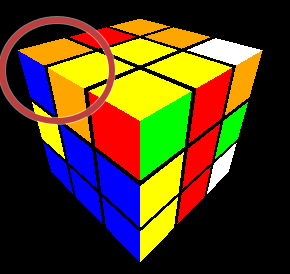
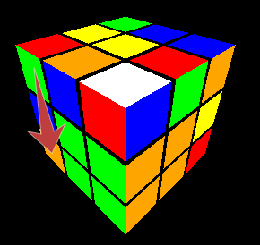
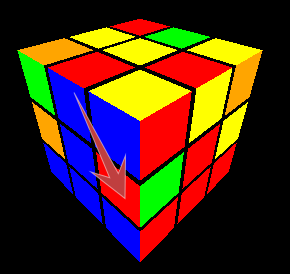
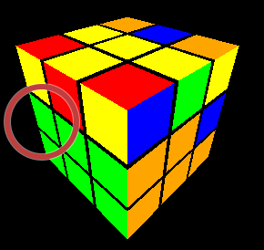
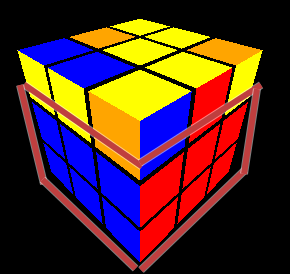
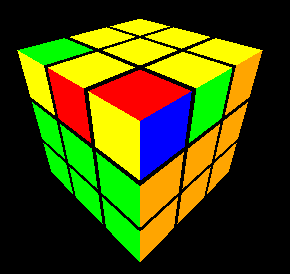
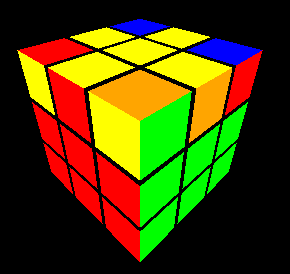
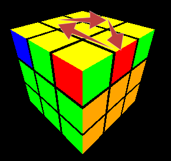

[English Version](./HowTo.md) | [German Version](./HowTo_DE.md) | [Spanish Version](./HowTo_ES.md) | [Chinese Version](./HowTo_CN.md)

# So verwenden Sie die Rubik's Cube-Anwendung

Willkommen bei der Rubik's Cube-Anwendung! Diese Anleitung hilft Ihnen, die Anwendung zu verstehen und den Rubik's Cube zu lösen.

Probieren Sie die App online aus: [Rubik's Cube Web Application](https://rubiks-cube-app-omega.vercel.app/)

## Erste Schritte

1. **Öffnen Sie die Anwendung**: Navigieren Sie zur URL der Anwendung in Ihrem Webbrowser.
2. **Titel und Link**: Oben auf der Seite sehen Sie den Titel "Rubik's Cube" und einen Link zu einer detaillierten Anleitung, wie man den Rubik's Cube löst.

## Übersicht über die Benutzeroberfläche

- **Rückgängig/Wiederholen-Tasten**: Unter dem Titel befinden sich diese Tasten, mit denen Sie Ihre letzten Züge rückgängig machen oder wiederholen können.
- **Mischen-Taste**: Diese Taste mischt den Würfel zufällig.
- **Sequenz ausführen-Taste**: Geben Sie eine Zugfolge in das Textfeld ein und klicken Sie auf diese Taste, um sie auszuführen.
- **Gelöst setzen-Taste**: Setzt den Würfel in den gelösten Zustand zurück.
- **Hinweistext**: Zeigt Hinweise an, die Ihnen beim Lösen des Würfels basierend auf seinem aktuellen Zustand helfen.
- **Einzelzug-Tasten**: Um Züge auf mobilen Geräten ohne Tastatur auszuführen.

## Steuerung

### Tastenkombinationen

- **NumPad-Zahlen**: Drehen Sie den gesamten Würfel.
  - `1` (x)
  - `9` (x')
  - `6` (y)
  - `4` (y')
  - `7` (z)
  - `3` (z')
- **Flächenrotationen**: Verwenden Sie die folgenden Tasten, um bestimmte Flächen zu drehen:
  - `U` (Oben)
  - `R` (Rechts)
  - `L` (Links)
  - `F` (Vorne)
  - `B` (Hinten)
  - `D` (Unten)
  - **Scheibenbewegungen**: Drehen Sie den gesamten Würfel.
  - `M` (Scheibe x)
  - `E` (Scheibe y)
  - `S` (Scheibe z)
- **Modifikatoren** (halten Sie gedrückt, während Sie Flächen drehen):
  - `'` oder `#`: Drehen Sie gegen den Uhrzeigersinn.
  - `w`: Drehen Sie breit.

### Tasten

- **Mischen**: Klicken Sie, um den Würfel zufällig zu mischen.
- **Sequenz ausführen**: Geben Sie eine Zugfolge in das Textfeld ein und klicken Sie, um sie auszuführen.
- **Gelöst setzen**: Klicken Sie, um den Würfel in den gelösten Zustand zurückzusetzen.
- **Rückgängig/Wiederholen**: Klicken Sie, um Ihre letzten Züge rückgängig zu machen oder zu wiederholen.

## Den Würfel lösen

Die Anwendung bietet Hinweise, die Ihnen beim Lösen des Würfels helfen:

1. **Machen Sie ein weißes Kreuz**: Der erste Hinweis fordert Sie auf, ein weißes Kreuz auf der oberen Fläche zu machen.
2. **Vervollständigen Sie die erste Schicht**: Sobald das weiße Kreuz fertig ist, führt Sie der nächste Hinweis dazu, die erste Schicht mit der weißen Fläche zu vervollständigen.
3. **Vervollständigen Sie die ersten zwei Schichten**: Nachdem Sie die erste Schicht vervollständigt haben, führt Sie der Hinweis dazu, die ersten zwei Schichten zu vervollständigen.
4. **Lösen Sie den Würfel**: Schließlich führt Sie der Hinweis dazu, den gesamten Würfel zu lösen.

### Komplexere Züge

Hier sind die komplexeren Züge, die Sie mit den Tasten in der Anwendung ausführen können:

- **Ecke links drehen**: `L' U2 L U`
- **Ecke rechts drehen**: `R U2 R' U'`
- **Ecke links einfügen**: `L' U' L`
- **Ecke rechts einfügen**: `R U R'`
- **Automatischer Zug links**: `U' L' U L U F U' F'`
- **Automatischer Zug rechts**: `U R U' R' U' F' U F`
- **Linie zu Fisch**: `F R U R' U' F'`
- **Ecke zu Fisch**: `Fw R U R' U' Fw'`
- **Fisch zu Gelb**: `R U R' U R U2 R'`
- **3 Kanten drehen**: `R' U R' U' R' U' R' U R U R2`
- **3 Ecken drehen**: `R U' R D2 R' U R D2 R2`

## Den Würfel lösen

### Ein weißes Kreuz machen
Sie benötigen nur einfache Züge dafür.

#### Beabsichtigtes Ergebnis:
|||
|--------|-------|
| ||

### Die erste Schicht vervollständigen

Hinweis: Drehen Sie den Würfel mit dem gelben Mittelstück nach oben.

#### Schritt 1 - Die Ecken einfügen

* Wir möchten die richtigen Kantenstücke von der oberen Schicht in die rechte untere Ecke einfügen.
* Platzieren Sie dazu das entsprechende Stück in der entsprechenden Ecke auf der oberen Schicht.
* Wenn die Ecke die weiße Fläche oben hat, müssen wir die Ecke mit dem entsprechenden Zug drehen (entweder auf der linken oder rechten Seite).
* Schließlich können Sie die Ecke von oben in die untere Schicht einfügen.

##### Beispiel - Ecke rechts drehen
R U2 R' U'
| Vorher | Nachher |
|--------|-------|
|  |  |

##### Beispiel - Ecke links drehen
L' U2 L U
| Vorher | Nachher |
|--------|-------|
|  |  |

##### Beispiel - Ecke rechts einfügen
R U R'
| Vorher | Nachher |
|--------|-------|
|  |  |

##### Beispiel - Ecke links einfügen
L' U' L
| Vorher | Nachher |
|--------|-------|
|  |  |

#### Schritt 2 - Kanten mit automatischem Zug einfügen
* Wir möchten Kanten auf der oberen Schicht an die richtige Stelle in der zweiten Schicht einfügen.
* Platzieren Sie die entsprechende Kante auf der rechten Fläche, um sie einzufügen.
* Führen Sie dann den automatischen Zug (entweder links oder rechts) aus, um die Ecke einzufügen.
* Wenn Ihre Kante nicht in der oberen Schicht, sondern in der zweiten Schicht ist, müssen Sie sie zuerst in die obere Schicht bringen, indem Sie eine andere Kante an ihrer Stelle mit dem automatischen Zug einfügen.

##### Beispiel - Kante rechts einfügen
U R U' R' U' F' U F (Automatischer Zug rechts)
| Vorher | Nachher |
|--------|-------|
|  |  |

##### Beispiel - Kante links einfügen
U' L' U L U F U' F' (Automatischer Zug links)
| Vorher | Nachher |
|--------|-------|
|  |  |

#### Beabsichtigtes Ergebnis:

|||
|--------|-------|
|||

### Die letzte Schicht lösen
#### Schritt 1 - Linie oder Ecke zu Fisch
Hinweis: Wenn Sie keine Linie oder Ecke haben (d. h. Sie haben nur einen Punkt), machen Sie einfach den Zug "Linie zu Fisch", um eine Ecke zu erhalten.

##### Beispiel - Linie zu Fisch
(Die Linie muss zentral und horizontal sein, wie im Bild)

F R U R' U' F' (Linie zu Fisch)
| Vorher | Nachher |
|--------|-------|
|  |  |

##### Beispiel - Ecke zu Fisch
(Die Ecke muss vorne rechts sein, wie im Bild)

Fw R U R' U' Fw' (Ecke zu Fisch)
| Vorher | Nachher |
|--------|-------|
|  |  |

#### Schritt 2 - Vom Fisch zur gelben Fläche
* Es gibt 7 Arten von Fischen.
* Mit dem Zug **Fisch zu Gelb** können Sie eine gelbe letzte Schicht aus Fisch Typ 1a erhalten.
* Für andere Fischarten können Sie den Zug **Fisch zu Gelb** verwenden, um den Fisch Typ 1a zu erhalten. Experimentieren Sie ein wenig! Möglicherweise müssen Sie den Zug mehrmals wiederholen, bis Sie ihn beherrschen.

| Typ 1a | Typ 1b |
|--------|-------|
|  |  |

| Typ 2 | Typ 3 |
|--------|-------|
|  |  |

| Typ 4 | Typ 5 |
|--------|-------|
|  |  |

| Typ 6 | |
|--------|-------|
|  | |

##### Beispiel - Fisch Typ 1a zur gelben letzten Schicht
R U R' U R U2 R' (Fisch zu Gelb)
| Vorher | Nachher |
|--------|-------|
|  |  |

#### Schritt 3 - Die gelben Kanten ausrichten:
* a) Drehen Sie die obere Schicht, um eine Kante in die richtige Position zu bringen.
* b) Verwenden Sie den Zug **3 Kanten drehen**, um die verbleibenden Kanten im Uhrzeigersinn zu drehen. 
* Je nachdem, wie die Kanten anfangs sind, müssen Sie das Verfahren (a und b) möglicherweise wiederholen.

##### Beispiel - 3 Kanten drehen
(Die gut ausgerichtete Kante muss vorne sein, wie im Bild)

R' U R' U' R' U' R' U R U R2 (3 Kanten drehen)
| Vorher | Nachher |
|--------|-------|
|  |  |

#### Schritt 4 - Die gelben Ecken ausrichten:
* Stellen Sie die gelbe Fläche nach vorne.
* Drehen Sie die gelbe (vordere) Fläche, um eine korrekt ausgerichtete Kante zu erhalten.
* a) Drehen Sie den Würfel, um die korrekt ausgerichtete Kante vorne links oben zu platzieren (wenn keine korrekt ausgerichtete Kante vorhanden ist, überspringen Sie diesen und den nächsten Schritt; Sie müssen ihn später wiederholen).
* b) Drehen Sie die obere Schicht, um eine Kante in die richtige Position zu bringen.
* c) Verwenden Sie den Zug **3 Ecken drehen**, um die verbleibenden Ecken gegen den Uhrzeigersinn zu drehen. 
* Je nachdem, wie die Ecken anfangs sind, müssen Sie das Verfahren (a, b und c) möglicherweise wiederholen.

##### Beispiel - 3 Ecken drehen
(Die gut ausgerichtete Ecke muss vorne links oben sein, wie im Bild)

R U' R D2 R' U R D2 R2 (3 Ecken drehen)
| Vorher | Nachher |
|--------|-------|
|  |  |

**Herzlichen Glückwunsch, Sie haben den Würfel gelöst!**

## Fazit

Viel Spaß beim Lösen des Rubik's Cube mit dieser Anwendung! Viel Spaß beim Cubing!