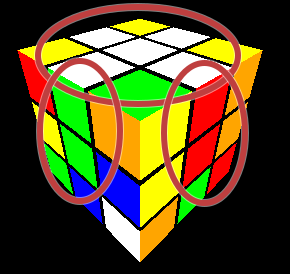
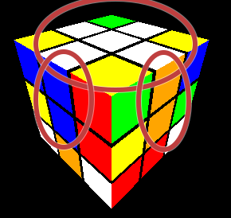
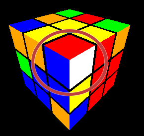
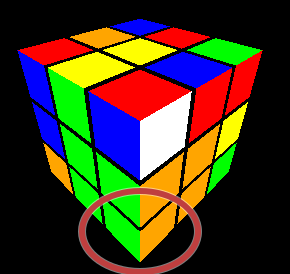
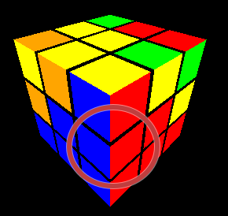
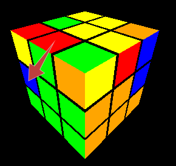
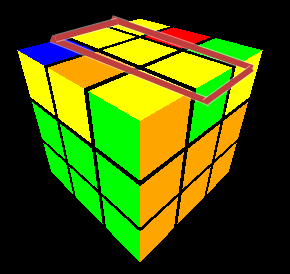
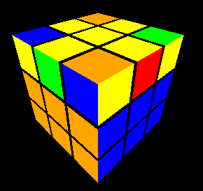
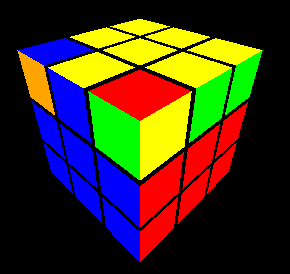

[English Version](./HowTo.md) | [German Version](./HowTo_DE.md) | [Spanish Version](./HowTo_ES.md) | [Chinese Version](./HowTo_CN.md)

# Cómo usar la aplicación del Cubo de Rubik

¡Bienvenido a la aplicación del Cubo de Rubik! Esta guía te ayudará a entender cómo usar la aplicación para resolver un Cubo de Rubik.

Prueba la aplicación en línea: [Aplicación web del Cubo de Rubik](https://rubiks-cube-app-omega.vercel.app/)

## Empezando

1. **Abrir la aplicación**: Navega a la URL de la aplicación en tu navegador web.
2. **Título y enlace**: En la parte superior de la página, verás el título "Cubo de Rubik" y un enlace a una guía detallada sobre cómo resolver el Cubo de Rubik.

## Descripción de la interfaz

- **Botones de Deshacer/Rehacer**: Ubicados debajo del título, estos botones te permiten deshacer o rehacer tus últimos movimientos.
- **Botón de Mezclar Cubo**: Este botón mezcla el cubo aleatoriamente.
- **Botón de Ejecutar Secuencia**: Ingresa una secuencia de movimientos en el campo de texto y haz clic en este botón para ejecutarlos.
- **Botón de Establecer Resuelto**: Restablece el cubo al estado resuelto.
- **Texto de Pista**: Muestra pistas para guiarte en la resolución del cubo según su estado actual.
- **Botones de Movimiento Único**: Para realizar movimientos en dispositivos móviles sin teclado.

## Controles

### Atajos de teclado

- **Números del teclado numérico**: Gira todo el cubo.
  - `1` (x)
  - `9` (x')
  - `6` (y)
  - `4` (y')
  - `7` (z)
  - `3` (z')
- **Rotaciones de caras**: Usa las siguientes teclas para girar caras específicas:
  - `U` (cara superior)
  - `R` (cara derecha)
  - `L` (cara izquierda)
  - `F` (cara frontal)
  - `B` (cara trasera)
  - `D` (cara inferior)
  - **Movimientos de capas**: Gira todo el cubo.
  - `M` (capa x)
  - `E` (capa y)
  - `S` (capa z)
- **Modificadores** (mantén presionado mientras giras las caras):
  - `'` o `#`: Gira en sentido antihorario.
  - `w`: Gira ampliamente.

### Botones

- **Mezclar Cubo**: Haz clic para mezclar el cubo aleatoriamente.
- **Ejecutar Secuencia**: Ingresa una secuencia de movimientos en el campo de texto y haz clic para ejecutarlos.
- **Establecer Resuelto**: Haz clic para restablecer el cubo al estado resuelto.
- **Deshacer/Rehacer**: Haz clic para deshacer o rehacer tus últimos movimientos.

## Resolver el cubo

La aplicación proporciona pistas para guiarte en la resolución del cubo:

1. **Hacer una cruz blanca**: La primera pista te pedirá que hagas una cruz blanca en la cara superior.
2. **Completar la primera capa**: Una vez que la cruz blanca esté completa, la siguiente pista te guiará para completar la primera capa con la cara blanca.
3. **Completar las dos primeras capas**: Después de completar la primera capa, la pista te guiará para completar las dos primeras capas.
4. **Resolver el cubo**: Finalmente, la pista te guiará para resolver todo el cubo.

### Movimientos más complejos

Aquí están los movimientos más complejos que puedes realizar usando los botones en la aplicación:

- **Girar esquina izquierda**: `L' U2 L U`
- **Girar esquina derecha**: `R U2 R' U'`
- **Insertar esquina izquierda**: `L' U' L`
- **Insertar esquina derecha**: `R U R'`
- **Movimiento automático izquierda**: `U' L' U L U F U' F'`
- **Movimiento automático derecha**: `U R U' R' U' F' U F`
- **Línea a pez**: `F R U R' U' F'`
- **Esquina a pez**: `Fw R U R' U' Fw'`
- **Pez a amarillo**: `R U R' U R U2 R'`
- **Girar 3 aristas**: `R' U R' U' R' U' R' U R U R2`
- **Girar 3 esquinas**: `R U' R D2 R' U R D2 R2`

## Resolver el cubo

### Hacer una cruz blanca
Solo necesitas movimientos simples para esto.

#### Resultado esperado:
|||
|--------|-------|
| ||

### Completar la primera capa

Pista: Gira el cubo con la pieza central amarilla hacia la cara superior.

#### Paso 1 - Insertar las esquinas

* Queremos insertar las piezas de borde correctas de la capa superior en la esquina inferior derecha.
* Para esto, coloca la pieza correspondiente en la esquina correspondiente en la capa superior.
* Si la esquina tiene la cara blanca en la parte superior, necesitamos girar la esquina con el movimiento correspondiente (ya sea en el lado izquierdo o derecho).
* Finalmente, puedes insertar la esquina de la parte superior a la capa inferior.

##### Ejemplo - Girar esquina derecha
R U2 R' U'
| Antes | Después |
|--------|-------|
|  |  |

##### Ejemplo - Girar esquina izquierda
L' U2 L U
| Antes | Después |
|--------|-------|
|  |  |

##### Ejemplo - Insertar esquina derecha
R U R'
| Antes | Después |
|--------|-------|
|  |  |

##### Ejemplo - Insertar esquina izquierda
L' U' L
| Antes | Después |
|--------|-------|
|  |  |

#### Paso 2 - Insertar aristas con movimiento automático
* Queremos insertar aristas en la capa superior en el lugar correcto en la segunda capa.
* Coloca la arista correspondiente en la cara derecha para ser introducida.
* Luego realiza el movimiento automático (ya sea a la izquierda o a la derecha) para insertar la esquina.
* Si tu arista no está en la capa superior, sino en la segunda, primero debes llevarla a la capa superior insertando cualquier otra arista en su lugar con el movimiento automático.

##### Ejemplo - Insertar arista derecha
U R U' R' U' F' U F (Movimiento automático derecha)
| Antes | Después |
|--------|-------|
|  |  |

##### Ejemplo - Insertar arista izquierda
U' L' U L U F U' F' (Movimiento automático izquierda)
| Antes | Después |
|--------|-------|
|  |  |

#### Resultado esperado:

|||
|--------|-------|
|||

### Resolver la última capa
#### Paso 1 - Línea o esquina a pez
Pista: Si no tienes una línea o esquina (es decir, solo tienes un punto), simplemente realiza el movimiento "Línea a pez" para obtener una esquina.

##### Ejemplo - Línea a pez
(La línea debe ser central y horizontal, como en la imagen)

F R U R' U' F' (Línea a pez)
| Antes | Después |
|--------|-------|
|  |  |

##### Ejemplo - Esquina a pez
(La esquina debe estar en la parte delantera derecha, como en la imagen)

Fw R U R' U' Fw' (Esquina a pez)
| Antes | Después |
|--------|-------|
|  |  |

#### Paso 2 - De pez a cara amarilla
* Hay 7 tipos de peces.
* Con el movimiento **Pez a amarillo**, puedes obtener una última capa amarilla del tipo de pez 1a.
* Para otros tipos de peces, puedes usar el movimiento **Pez a amarillo** para obtener el tipo de pez 1a. ¡Experimenta un poco! Puede que necesites repetir el movimiento varias veces hasta que lo aprendas.

| Tipo 1a | Tipo 1b |
|--------|-------|
|  |  |

| Tipo 2 | Tipo 3 |
|--------|-------|
|  |  |

| Tipo 4 | Tipo 5 |
|--------|-------|
|  |  |

| Tipo 6 | |
|--------|-------|
|  | |

##### Ejemplo - Tipo de pez 1a a última capa amarilla
R U R' U R U2 R' (Pez a amarillo)
| Antes | Después |
|--------|-------|
|  |  |

#### Paso 3 - Orientar las aristas amarillas:
* a) Gira la capa superior para tener una arista en la posición correcta.
* b) Usa el movimiento **Girar 3 aristas** para girar las aristas restantes en sentido horario. 
* Dependiendo de cómo estén las aristas inicialmente, puede que necesites repetir el procedimiento (a y b).

##### Ejemplo - Girar 3 aristas
(La arista bien orientada debe estar al frente, como en la imagen)

R' U R' U' R' U' R' U R U R2 (Girar 3 aristas)
| Antes | Después |
|--------|-------|
|  |  |

#### Paso 4 - Orientar las esquinas amarillas:
* Coloca la cara amarilla al frente.
* Gira la cara amarilla (frontal) para obtener una arista correctamente orientada.
* a) Gira el cubo para colocar la arista correctamente orientada en la parte delantera izquierda superior (si no hay ninguna arista correctamente orientada, omite este y el siguiente paso; necesitarás repetirlo más tarde).
* b) Gira la capa superior para tener una arista en la posición correcta.
* c) Usa el movimiento **Girar 3 esquinas** para girar las esquinas restantes en sentido antihorario. 
* Dependiendo de cómo estén las esquinas inicialmente, puede que necesites repetir el procedimiento (a, b y c).

##### Ejemplo - Girar 3 esquinas
(La esquina bien orientada debe estar en la parte delantera izquierda superior, como en la imagen)

R U' R D2 R' U R D2 R2 (Girar 3 esquinas)
| Antes | Después |
|--------|-------|
|  |  |

**¡Felicidades, has terminado el cubo!**

## Conclusión

¡Disfruta resolviendo el Cubo de Rubik con esta aplicación! ¡Feliz cubing!